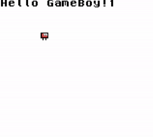

# GameBoy Game

Very simple application for GameBoy.

## Build

Run `make` command when you are in the same directory as the makefile.

Works on OSX.

## Run app

After compilation you will find `dist/main.gb` file. To run it you need to use emulator (e.g. [Sameboy](https://sameboy.github.io/)).

## Inspirations

* [GamingMonsters YT channel](https://www.youtube.com/watch?v=HIsWR_jLdwo) - Movie series about developing GameBoy games
* [GBDK.js](https://www.gbdkjs.com/docs/installation/) - Set of libs that allows to generates ROM files!
* [Sameboy](https://sameboy.github.io/) - GameBoy emulator for OSX
* [gbdev/awesome-gbdev](https://github.com/gbdev/awesome-gbdev) - List of awesome stuff about developing GameBoy apps
